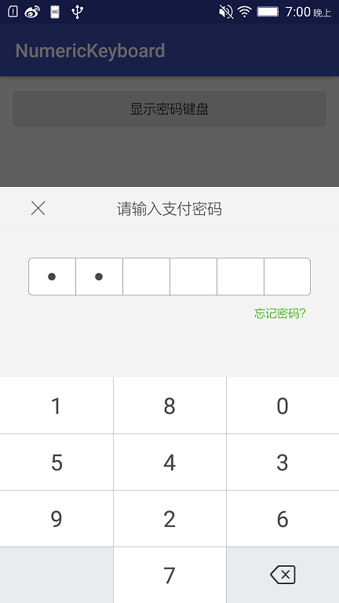

# NumericKeyboard
随机数字键盘，仿支付宝支付密码UI。

# Gradle
    compile ('com.xyzlf.custom.keyboard:keyboard:0.0.1') {
        	exclude group: 'com.android.support', module: 'appcompat-v7'
    }

# 效果图

# 使用方式

1、初始化KeyboardDialg。

2、设置监听回调。

	final KeyboardDialog dialog = new KeyboardDialog(MainActivity.this);
    dialog.setKeyboardLintener(new IKeyboardListener() {
        @Override
        public void onPasswordChange(String pwd) {
            Toast.makeText(MainActivity.this, "change:" + pwd, Toast.LENGTH_SHORT).show();
        }

        @Override
        public void onPasswordComplete(String pwd) {
            Toast.makeText(MainActivity.this, "complete:" + pwd, Toast.LENGTH_SHORT).show();
            dialog.dismiss();
        }

        @Override
        public void onForgetPwd() {
            Toast.makeText(MainActivity.this, "forget password", Toast.LENGTH_SHORT).show();
        }
    });
    dialog.show();

# 参考

Android仿支付宝淘宝 - 自定义密码输入框和键盘：<http://blog.csdn.net/z240336124/article/details/53739790>

# 关于我
有任何使用问题，可以给我发邮件：

Author：张利峰

E-mail：519578280@qq.com

# License

    Copyright(c)2017 xyzlf Open Source Project
    
    Licensed under the Apache License, Version 2.0 (the "License");
    you may not use this file except in compliance with the License.
    You may obtain a copy of the License at
    
    http://www.apache.org/licenses/LICENSE-2.0
    
    Unless required by applicable law or agreed to in writing, software
    distributed under the License is distributed on an "AS IS" BASIS,
    WITHOUT WARRANTIES OR CONDITIONS OF ANY KIND, either express or implied.
    See the License for the specific language governing permissions and
    limitations under the License.k